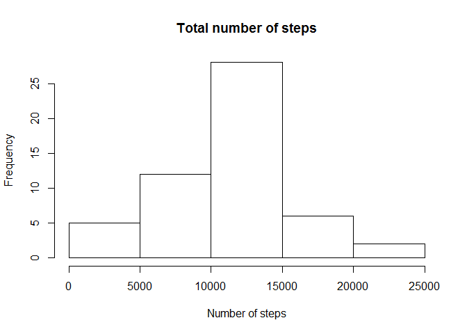
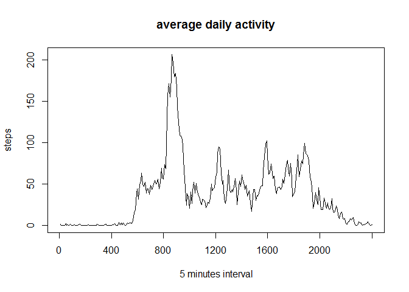
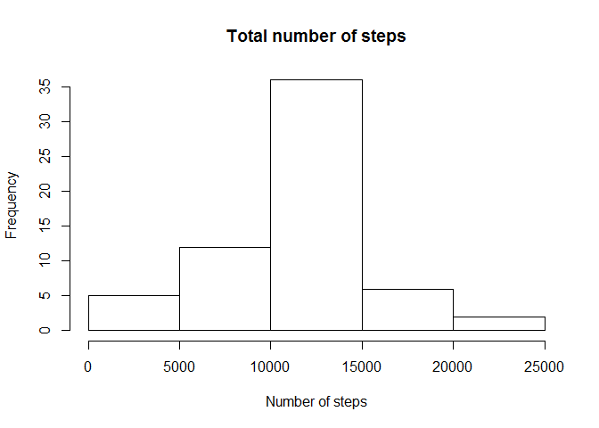

# Reproducible Research: Peer Assessment 1


## Loading and preprocessing the data


```r
data = read.csv(unz("activity.zip","activity.csv"),colClasses = c("numeric","Date","numeric"))
attach(data)
summary(data)
```

```
##      steps             date               interval     
##  Min.   :  0.00   Min.   :2012-10-01   Min.   :   0.0  
##  1st Qu.:  0.00   1st Qu.:2012-10-16   1st Qu.: 588.8  
##  Median :  0.00   Median :2012-10-31   Median :1177.5  
##  Mean   : 37.38   Mean   :2012-10-31   Mean   :1177.5  
##  3rd Qu.: 12.00   3rd Qu.:2012-11-15   3rd Qu.:1766.2  
##  Max.   :806.00   Max.   :2012-11-30   Max.   :2355.0  
##  NA's   :2304
```

## What is mean total number of steps taken per day?

1. *Make a histogram of the total number of steps taken each day*


```r
total_steps = by(steps,date,sum)
hist(total_steps,main="Total number of steps",xlab="Number of steps")
```

 

2. *Calculate and report the mean and median total number of steps taken per day*


```r
mean(total_steps,na.rm=T)
```

```
## [1] 10766.19
```

```r
median(total_steps,na.rm=T)
```

```
## [1] 10765
```

## What is the average daily activity pattern?

1. *Make a time series plot (i.e. type = "l") of the 5-minute interval (x-axis) and the average number of steps taken, averaged across all days (y-axis)*


```r
average_activity = by(steps,interval,mean,na.rm=T)
plot(average_activity,type="l",main="average daily activity",ylab="steps",xlab="5 minutes interval",xaxt="n")
axis(1, at=0:6*48, labels=names(average_activity)[0:6*48 +1])
```

 

2. *Which 5-minute interval, on average across all the days in the dataset, contains the maximum number of steps?*


```r
maximum = sort(average_activity,decreasing = T)[1]
names(maximum)
```

```
## [1] "835"
```

## Imputing missing values

1. *Calculate and report the total number of missing values in the dataset (i.e. the total number of rows with NAs)*


```r
sum(is.na(steps))
```

```
## [1] 2304
```

2. *Devise a strategy for filling in all of the missing values in the dataset. The strategy does not need to be sophisticated. For example, you could use the mean/median for that day, or the mean for that 5-minute interval, etc.*

The strategy is to fill missing values with the mean for that 5-minute interval

3. *Create a new dataset that is equal to the original dataset but with the missing data filled in.*


```r
cdata = data
cdata[is.na(cdata),1] = average_activity[as.character(cdata[is.na(cdata),3])]
summary(cdata)
```

```
##      steps             date               interval     
##  Min.   :  0.00   Min.   :2012-10-01   Min.   :   0.0  
##  1st Qu.:  0.00   1st Qu.:2012-10-16   1st Qu.: 588.8  
##  Median :  0.00   Median :2012-10-31   Median :1177.5  
##  Mean   : 37.38   Mean   :2012-10-31   Mean   :1177.5  
##  3rd Qu.: 27.00   3rd Qu.:2012-11-15   3rd Qu.:1766.2  
##  Max.   :806.00   Max.   :2012-11-30   Max.   :2355.0
```

```r
detach(data)
attach(cdata)
```

4. *Make a histogram of the total number of steps taken each day and Calculate and report the **mean** and **median** total number of steps taken per day.*


```r
total_steps = by(steps,date,sum)
hist(total_steps,main="Total number of steps",xlab="Number of steps")
```

 

The **mean** and **median** total number of steps taken per day for the new dataset:


```r
mean(total_steps,na.rm=T)
```

```
## [1] 10766.19
```

```r
median(total_steps,na.rm=T)
```

```
## [1] 10766.19
```

*Do these values differ from the estimates from the first part of the assignment?*  
The mean and the median value are the same as the ones in the first part of the assignment.

*What is the impact of imputing missing data on the estimates of the total daily number of steps?*  
The frequency corresponding to the average daily number of steps is lower.

## Are there differences in activity patterns between weekdays and weekends?

1. *Create a new factor variable in the dataset with two levels -- "weekday" and "weekend" indicating whether a given date is a weekday or weekend day.*


```r
weekdays = factor(apply(cdata,1,function(x) { if (weekdays(as.Date(x[2])) %in% c("Saturday","Sunday")) "weekend" else "weekday" }))
cdata = data.frame(cdata,weekdays)
summary(cdata)
```

```
##      steps             date               interval         weekdays    
##  Min.   :  0.00   Min.   :2012-10-01   Min.   :   0.0   weekday:12960  
##  1st Qu.:  0.00   1st Qu.:2012-10-16   1st Qu.: 588.8   weekend: 4608  
##  Median :  0.00   Median :2012-10-31   Median :1177.5                  
##  Mean   : 37.38   Mean   :2012-10-31   Mean   :1177.5                  
##  3rd Qu.: 27.00   3rd Qu.:2012-11-15   3rd Qu.:1766.2                  
##  Max.   :806.00   Max.   :2012-11-30   Max.   :2355.0
```

2. *Make a panel plot containing a time series plot (i.e. type = "l") of the 5-minute interval (x-axis) and the average number of steps taken, averaged across all weekday days or weekend days (y-axis).*


```r
average_activity = by(cdata$steps,cdata[,c("interval","weekdays")],mean)
summary(average_activity)
```

```
##     weekday           weekend       
##  Min.   :  0.000   Min.   :  0.000  
##  1st Qu.:  2.247   1st Qu.:  1.241  
##  Median : 25.803   Median : 32.340  
##  Mean   : 35.611   Mean   : 42.366  
##  3rd Qu.: 50.854   3rd Qu.: 74.654  
##  Max.   :230.378   Max.   :166.639
```

```r
d1 = data.frame(steps=average_activity[,1],interval=cdata[1:288,3],weekday=rep("weekday",288))
d2 = data.frame(steps=average_activity[,2],interval=cdata[1:288,3],weekday=rep("weekend",288))
dd = rbind(d1,d2)
library(lattice)
xyplot(dd$steps ~ dd$interval | dd$weekday, type="l", layout=c(1,2), xlab="Interval", ylab="Number of steps")
```

 


